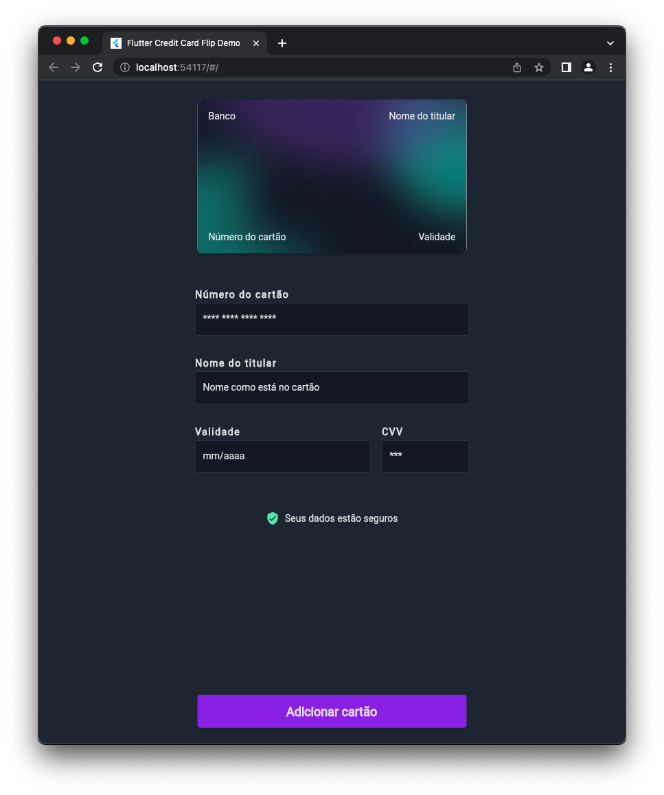
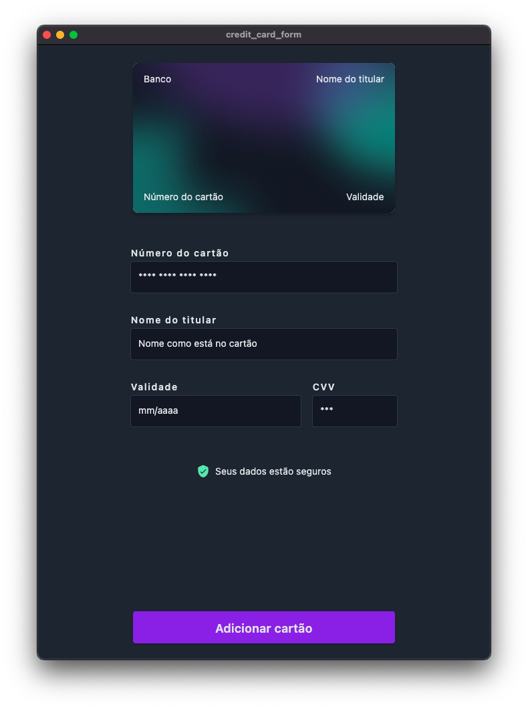

# Credit Card Form in Flutter

This is a challenge project.
The goal is to create a credit card form with a flip animation.

## Screenshots






## How to run

- First install Flutter SDK

```bash
# linux
sudo snap install flutter --classic

# mac
brew cask install flutter

# windows
choco install flutter
```

- Clone this repository

```bash
git clone https://github.com/HenriqueNas/credit_card_form
```

- Then run the following commands:

```bash
flutter pub get
flutter run
```
